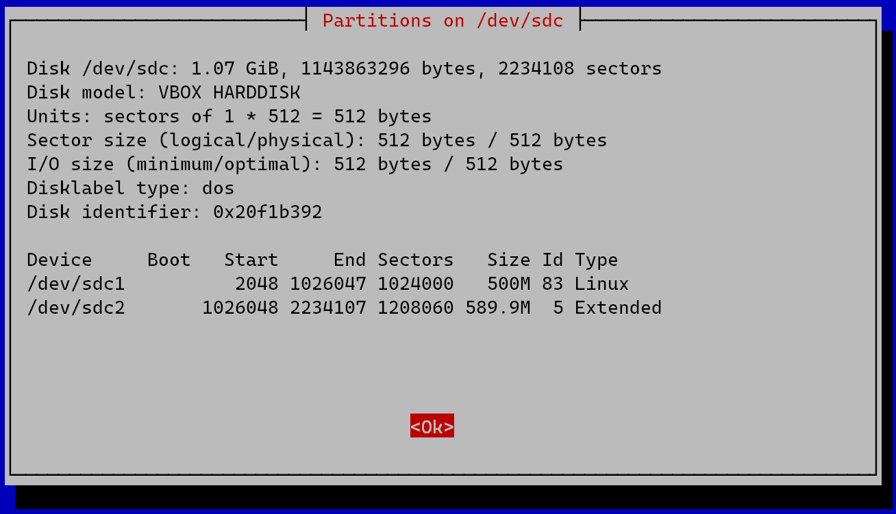

# **WhipDisk: Interactive Disk Management Tool**

## About
**WhipDisk** is a simple, interactive disk and partition management utility built using Bash and Whiptail. It provides a graphical interface for tasks such as creating, deleting, and managing partitions without needing complex terminal commands. Designed for Linux users, it simplifies disk management for beginners while remaining powerful for advanced users.

---

## Features
- **Disk Selection**: Easily select the disk to manage from a menu.
- **View Partitions**: Display detailed information about existing partitions.
- **Create Partitions**: Add new primary or extended partitions with a choice of size.
- **Delete Partitions**: Select a partition from a menu to delete it safely.
- **Write Changes**: Save your partitioning changes directly to the disk.
- **Interactive GUI**: Built with Whiptail for a user-friendly graphical interface.

---

## Requirements
- Linux environment
- Root privileges (use `sudo`)
- `fdisk` installed
- `whiptail` installed (comes pre-installed in most distributions)

---

## Installation
1. Clone this repository:
   ```bash
   git clone https://github.com/yourusername/WhipDisk.git
   cd WhipDisk
   ```
2. Make the script executable:
   ```bash
   chmod +x whipdisk.sh
   ```

---

## Usage
1. Run the script as root:
   ```bash
   sudo ./whipdisk.sh
   ```
2. Follow the on-screen prompts to:
    - Select a disk
    - Manage partitions (create, delete, or view)
    - Write changes to disk

---

## Screenshots
### 1. Disk Selection


### 2. View Partitions


### 3. Create Partition


### 4. Delete Partition


---

## Notes
- Ensure you have backed up your data before making changes to your disks.
- Changes made using this script are **irreversible** once written to disk.

---

## Contributing
Contributions are welcome! If you find a bug or have a feature request, feel free to open an issue or submit a pull request.

---
